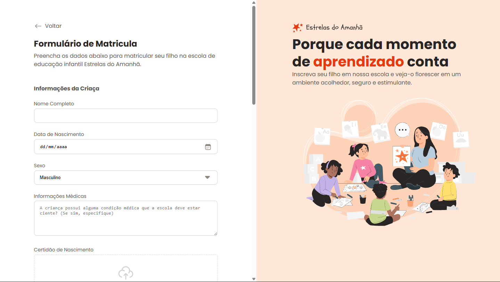

# 📚 Formulário de Matrícula - Estudo Pessoal

Este projeto é um **formulário de matrícula escolar** desenvolvido como prática de **HTML5** e **CSS3**, com foco em **design responsivo, acessibilidade e usabilidade**.  
Não possui backend — todo o projeto é **front-end estático**.

---

## 🚀 Tecnologias utilizadas
- **HTML5** → Estrutura semântica da página  
- **CSS3** → Estilização, layout responsivo e customização dos inputs  
- **Flexbox / Grid** → Organização dos elementos em tela  

---

## 🎨 Funcionalidades
- Campos para informações da criança e do responsável  
- Upload de **certidão de nascimento**  
- Seleção de turno escolar (manhã/tarde)  
- Escolha de esportes extracurriculares  
- Validação de campos obrigatórios (ex.: email)  
- Layout moderno com área ilustrada estática à direita  

---

## 📷 Preview
*(adicione aqui uma screenshot do seu projeto — exemplo:)*  

---

## 📂 Como visualizar
1. Baixe os arquivos do repositório  
2. Abra o `index.html` diretamente no navegador  

---

## 🔮 Possíveis melhorias futuras
- Integração com backend para salvar os dados  
- Conexão com banco de dados real  
- Implementação de validações mais avançadas em **JavaScript**  
- Melhorias de acessibilidade (ex.: leitores de tela)  

---

👨‍💻 **Projeto desenvolvido para estudos pessoais.**
